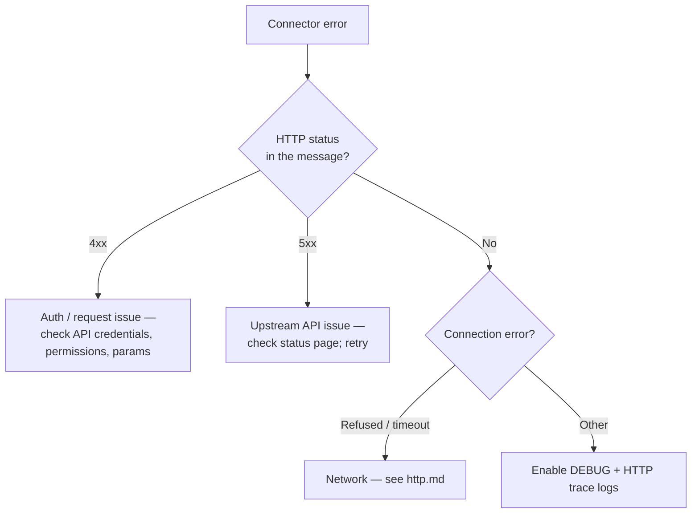

# gRPC and WebSocket Issues

## gRPC

| gRPC status         | Meaning                                        | Where to look in Ballerina                              |
| ------------------- | ---------------------------------------------- | ------------------------------------------------------- |
| `UNAVAILABLE`       | Server not running or unreachable              | Check the server address used to construct the stub     |
| `UNAUTHENTICATED`   | Missing or invalid credentials                 | Configure TLS / auth in `grpc:ClientConfiguration`      |
| `UNIMPLEMENTED`     | Method declared in the proto but not on server | Regenerate stubs and verify proto-file alignment        |
| `DEADLINE_EXCEEDED` | Call exceeded the client-side deadline         | Raise `timeout` in the call options                     |
| `INVALID_ARGUMENT`  | Server-side validation rejected the message    | Inspect the request message fields                      |

Regenerate stubs if a proto change isn't reflected in compile errors or behavior:

```bash
bal grpc --input service.proto --output ./generated --mode client
bal grpc --input service.proto --output ./generated --mode service
```

## WebSocket

| Symptom                                | Likely cause                                  | Fix                                                                  |
| -------------------------------------- | --------------------------------------------- | -------------------------------------------------------------------- |
| Upgrade request rejected               | Server not configured as a WebSocket endpoint | Use `websocket:Service` (or `http:WebSocketService`)                 |
| Connection closes unexpectedly         | Idle timeout or missing ping/pong handler     | Configure `pingPongHandler` and raise `idleTimeoutInSeconds`         |
| Messages not received                  | Frame size limit exceeded                     | Raise `maxFrameSize` in the listener config                          |
| `101 Switching Protocols` missing      | A proxy/load balancer is stripping `Upgrade`  | Configure the proxy to forward WebSocket upgrade headers             |

## General `ballerinax/*` connector errors

For third-party connector packages (Salesforce, GitHub, ServiceNow, Twilio, etc.), errors typically appear in one of these shapes:

```
error: {ballerinax/<connector>}Error <upstream message>
```

or as a wrapped HTTP error:

```
error: Error occurred while getting the HTTP response. status: 401, reason: Unauthorized
```

Triage:



Checklist for every connector failure:

1. Enable HTTP trace logs — connectors talk over HTTP and the raw request/response is the fastest way to ground-truth a problem (see [http.md](http.md)).
2. Verify API credentials (key, token, OAuth client id/secret) in `Config.toml`.
3. Check the upstream API's status page for an outage.
4. Confirm endpoint URL and API version.
5. Confirm the connector version supports the API version you're calling.
