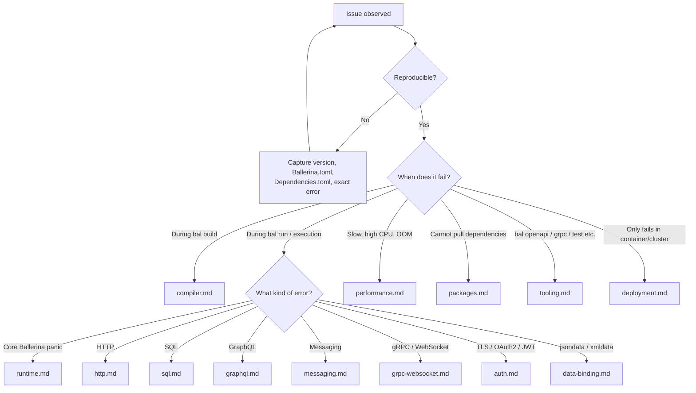

# Troubleshooting — Index

Use this file as a router. **Read only the topic file matching the symptom — do not preload all troubleshooting files.**

## Symptom → file

| Symptom                                                                  | Read                                       |
| ------------------------------------------------------------------------ | ------------------------------------------ |
| `bal build` reports `ERROR [file.bal:(line,col)] ...`                    | [compiler.md](compiler.md)                 |
| `bal build` prints `Oh no, something really went wrong` + JVM stack      | [compiler.md](compiler.md) §Crashes        |
| Runtime panic — `error: {ballerina}...` + stack trace during `bal run`   | [runtime.md](runtime.md)                   |
| HTTP client/listener — `{ballerina/http}...Error`, timeouts, 4xx/5xx     | [http.md](http.md)                         |
| SQL — `{ballerina/sql}DatabaseError`, `NoRowsError`, connection refused  | [sql.md](sql.md)                           |
| GraphQL — resolver errors, schema validation, subscription failures      | [graphql.md](graphql.md)                   |
| Kafka / RabbitMQ / NATS / JMS — connector or broker errors               | [messaging.md](messaging.md)               |
| gRPC or WebSocket failures                                               | [grpc-websocket.md](grpc-websocket.md)     |
| TLS handshake, PKIX path, OAuth2, JWT validation                         | [auth.md](auth.md)                         |
| `cloneWithType` / `fromJsonStringWithType` / data binding errors         | [data-binding.md](data-binding.md)         |
| High latency, throughput drops, OOM, GC pressure, thread starvation      | [performance.md](performance.md)           |
| `cannot resolve module`, `package not found`, version conflicts          | [packages.md](packages.md)                 |
| `bal openapi`, `bal grpc`, `bal test`, `bal persist`, formatter problems | [tooling.md](tooling.md)                   |
| Works locally, fails in Docker / Kubernetes / GraalVM native image       | [deployment.md](deployment.md)             |

## Cheat sheet — most common one-liners

| Error / Symptom                                            | Fix                                                                              |
| ---------------------------------------------------------- | -------------------------------------------------------------------------------- |
| `incompatible types: expected 'X', found 'Y'`              | Compare the variable type or function return type at the reported line          |
| `undefined symbol 'X'`                                     | Add the missing `import` or correct the identifier typo                          |
| `missing semicolon token`                                  | Inspect the preceding lines for unclosed brackets, parentheses, or strings       |
| `Oh no, something really went wrong`                       | Compiler bug — capture an MRE + the JVM stack trace                              |
| `No suitable driver found for jdbc:...`                    | Import the driver module, e.g. `import ballerinax/mysql.driver as _;`            |
| `Connection refused: host:port`                            | Confirm the target service is running and the URL/port is correct                |
| `MaximumWaitTimeExceededError` (HTTP/SQL pool)             | Raise `maxActiveConnections` in `poolConfig`, or fix the upstream bottleneck     |
| `{ballerina/sql}NoRowsError` from `queryRow()`             | Treat zero rows as a valid outcome and handle the union                          |
| `{ballerina}TypeCastError`                                 | Replace `<T>val` with `value:ensureType` or `if val is T { ... }`                |
| `SSL/TLS handshake failure` / `PKIX path building failed`  | Set `secureSocket` on the client config or trust the CA in the JRE truststore    |
| `cannot resolve module` / `package not found`              | Delete `Dependencies.toml` and rebuild; check network access to Ballerina Central |
| `bal: command not found`                                   | Add `<ballerina_home>/bin` to PATH and re-source the shell profile               |
| Configurable values fall back to defaults silently         | `Config.toml` must sit in the working directory and use `[org.package.module]` keys |
| `OutOfMemoryError`                                         | Raise JVM heap: `export JAVA_OPTS="-Xmx2g"`                                       |
| Listener works locally but unreachable from another host   | Bind the listener to `"0.0.0.0"` instead of `"localhost"`                         |
| `invalid access of mutable storage in 'isolated' function` | Wrap the access in `lock { ... }` or remove shared mutable state                 |

## Triage decision

## What to capture before diving in

Whatever the symptom, three pieces of context make every diagnosis faster:

1. **Ballerina version** — `bal --version`. Bugs and APIs are version-specific.
2. **Project files** — `Ballerina.toml` (package + declared deps) and `Dependencies.toml` (resolved lockfile).
3. **Full error output** — the complete stack trace, not just the last line. Run with debug logging where possible (see the relevant topic file for how to enable it).

## Reference links

- Ballerina docs: <https://ballerina.io/learn/>
- Language specification: <https://ballerina.io/spec/lang/>
- Ballerina Central (packages): <https://central.ballerina.io>
- Ballerina platform repos: <https://github.com/ballerina-platform>
