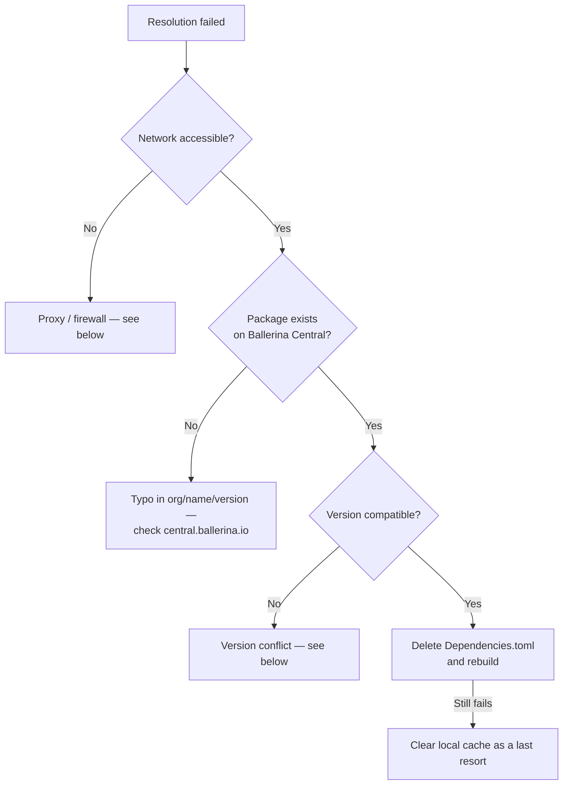

# Package and Dependency Issues

Covers `bal pull` failures, version conflicts, proxy/firewall handling, offline builds, and private packages.

## Resolution failures

Typical symptom:

```
cannot resolve module 'ballerina/http'
```

Diagnose in order:



### Step 1 — delete `Dependencies.toml` and rebuild

This forces a fresh resolution from Central. The file is regenerated:

```bash
rm Dependencies.toml
bal build
```

### Step 2 — clear the local cache (only if Step 1 doesn't help)

```bash
# Wipe the entire local package cache
rm -rf ~/.ballerina/repositories/central.ballerina.io/caches

# Or only one package
rm -rf ~/.ballerina/repositories/central.ballerina.io/bala/ballerinax/salesforce
```

## Version conflicts

Ballerina resolves dependencies transitively (similar to Maven). A conflict arises when two packages require incompatible versions of the same library.

Find conflicts:

```bash
bal build --dump-graph 2>&1 | grep -A 5 "conflict"
```

A typical error:

```
error: dependency conflict: 'ballerina/http' version '2.9.0' and '2.11.0' are both required
```

Options to resolve:

1. Pin the version explicitly in `Ballerina.toml`:
   ```toml
   [[dependency]]
   org = "ballerina"
   name = "http"
   version = "2.11.0"
   ```
2. Upgrade the Ballerina distribution to one where the conflict is already resolved.
3. Look for a newer version of the conflicting package that updates its own transitive dependency.

## Network, firewall, and proxy

Quick connectivity check against Ballerina Central:

```bash
# Basic reachability
curl -v https://api.central.ballerina.io/2.0/registry/packages/ballerina/http

# DNS
nslookup api.central.ballerina.io

# Proxy env vars already set?
env | grep -i proxy
```

### Configuring a proxy

In `<USER_HOME>/.ballerina/Settings.toml`:

```toml
# With credentials
[proxy]
host = "HOST_NAME"
port = PORT
username = "PROXY_USERNAME"
password = "PROXY_PASSWORD"

# Without credentials — keep username/password as empty strings
[proxy]
host = "HOST_NAME"
port = PORT
username = ""
password = ""
```

### Allowlist these endpoints

| Endpoint                                   | Purpose                       |
| ------------------------------------------ | ----------------------------- |
| `https://api.central.ballerina.io/`        | Package metadata and search   |
| `https://fileserver.central.ballerina.io/` | Package downloads             |
| `https://repo.maven.apache.org/maven2`     | Maven dependency resolution   |

### Proxy doing TLS inspection?

If you see `PKIX path building failed` going through a proxy, the proxy is intercepting TLS. Import its cert into the Ballerina JRE truststore (requires admin/sudo):

```bash
<BALLERINA_HOME>/dependencies/jdk-<version>/bin/keytool -import \
    -trustcacerts \
    -file proxy-cert.pem \
    -alias my-proxy-cert \
    -keystore <BALLERINA_HOME>/dependencies/jdk-<version>/lib/security/cacerts
```

Repeat per distribution if you have multiple installed.

## Offline builds

If the build host has no internet:

1. Build once online to populate `Dependencies.toml` and the local cache.
2. Switch the build to offline mode:

```bash
bal build --offline
```

Or in `Ballerina.toml`:

```toml
[build-options]
offline = true
sticky  = true
```

Offline mode only works if every required package is already in `~/.ballerina/repositories/`. A missing package fails with a clear error.

## Private packages

### Access token for Central

In `<USER_HOME>/.ballerina/Settings.toml`:

```toml
[central]
accesstoken = "<your-ballerina-central-access-token>"
```

Generate the token at <https://central.ballerina.io> → Settings → Access Tokens.

### Publishing

```bash
# Build the .bala archive
bal pack
# → target/bala/<org>-<name>-<platform>-<version>.bala

# Push to the local repository for local testing
bal push --repository=local
# → ~/.ballerina/repositories/local/

# Or push to Ballerina Central (needs accesstoken)
bal push
```

### Consuming a locally pushed package

```toml
[[dependency]]
org = "myorg"
name = "mylib"
version = "1.0.0"
repository = "local"
```

### Common private-package errors

| Error / symptom                              | Cause                                              | Fix                                                                         |
| -------------------------------------------- | -------------------------------------------------- | --------------------------------------------------------------------------- |
| `package not found` for a private package    | Access token missing or expired                    | Set `accesstoken` in `Settings.toml`; regenerate from the Central UI        |
| `package not found` for a local package      | `[[dependency]]` entry missing `repository = "local"` | Add `repository = "local"` to the dependency block                          |
| `bal push` fails with 401                    | Invalid or expired access token                    | Regenerate from <https://central.ballerina.io> → Settings → Access Tokens   |
