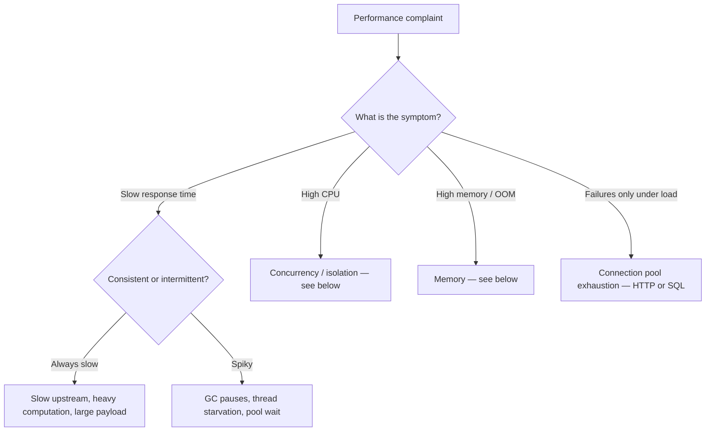

# Performance and Tuning

Performance issues need measurement, not log-reading. Identify the *shape* of the problem first, then tune the right knob.

## What kind of issue is it?



## HTTP connection pool

By far the most common load-related failure is connection pool exhaustion.

Signs:

- `{ballerina/http}MaximumWaitTimeExceededError`
- Requests timing out only under load
- Latency that climbs as throughput climbs

Defaults:

| Setting                | Default          | Notes                                      |
| ---------------------- | ---------------- | ------------------------------------------ |
| `maxActiveConnections` | `-1` (unlimited) | Set a cap to prevent resource exhaustion   |
| `maxIdleConnections`   | `100`            | Idle conns kept alive in the pool          |
| `waitTime`             | `30` seconds     | How long a request waits for a free conn   |

Tuning example:

```ballerina
http:Client apiClient = check new ("http://backend.example.com", {
    poolConfig: {
        maxActiveConnections: 200,   // tune to upstream capacity
        maxIdleConnections: 50,
        waitTime: 10                 // fail fast on exhaustion
    },
    timeout: 30
});
```

> Raising `maxActiveConnections` only helps if the **upstream can absorb the extra concurrency**. If the upstream is the bottleneck, more connections will make latency worse, not better.

## SQL connection pool

Defaults:

| Setting                  | Default                      | Config key                              | Notes                                                                                                  |
| ------------------------ | ---------------------------- | --------------------------------------- | ------------------------------------------------------------------------------------------------------ |
| `maxOpenConnections`     | `15`                         | `ballerina.sql.maxOpenConnections`      | Max total (idle + active)                                                                              |
| `maxConnectionLifeTime`  | `1800.0` (30 min)            | `ballerina.sql.maxConnectionLifeTime`   | Connections older than this are recycled                                                               |
| `minIdleConnections`     | same as `maxOpenConnections` | `ballerina.sql.minIdleConnections`      | Minimum kept warm. The default keeps the pool fully warm.                                              |
| `connectionTimeout`      | `30.0` seconds               | `ballerina.sql.connectionTimeout`       | Time waited for a free connection before failing                                                       |
| `idleTimeout`            | `600.0` seconds              | `ballerina.sql.idleTimeout`             | How long an idle connection survives before retirement                                                 |
| `leakDetectionThreshold` | `0` (disabled)               | `ballerina.sql.leakDetectionThreshold`  | Threshold (seconds) to flag a likely connection leak                                                   |

Override globally via `Config.toml`:

```toml
[ballerina.sql]
maxOpenConnections = 25
connectionTimeout = 10.0
```

…or per-client via `connectionPool`:

```ballerina
mysql:Client dbClient = check new (
    host = "db.example.com", port = 3306,
    user = "app", password = "...", database = "mydb",
    connectionPool = {
        maxOpenConnections: 25,
        maxConnectionLifeTime: 600.0,
        minIdleConnections: 5,
        connectionTimeout: 10.0,
        leakDetectionThreshold: 60.0
    }
);
```

Signs of exhaustion:

- `{ballerina/sql}DatabaseError` mentioning connection timeout
- Queries hanging until `connectionTimeout` is hit
- Latency that grows with concurrent load

> Always check the DB-side `max_connections` setting. Raising the Ballerina pool above the DB's limit just shifts errors from "pool exhausted" to "too many connections."

Lower `minIdleConnections` when traffic is bursty or when the database connection limit is shared across multiple services — that way idle connections are released back to the DB during quiet periods.

## Runtime thread pool

Ballerina's scheduler uses a fixed-size thread pool of `CPU cores × 2` by default. Tune via:

```bash
export BALLERINA_MAX_POOL_SIZE=16
bal run .
```

Raise it only if you have **blocking** calls tying up scheduler workers — most commonly legacy JDBC drivers or third-party Java libraries. Standard Ballerina I/O (HTTP, SQL via Ballerina libraries) is non-blocking and doesn't usually need a larger pool.

Diagnosing thread starvation:

1. Strand dump (`kill -SIGTRAP <PID>`, see [runtime.md](runtime.md)) — many strands stuck in `BLOCKED` suggests workers are tied up.
2. JVM thread dump (`jstack <PID>` or `kill -3 <PID>`) — look for threads named `ballerina-scheduler-*`. If they're all `BLOCKED`/`WAITING` inside a blocking call, the pool is starved.
3. Symptoms: new HTTP requests stop being accepted while the process is still alive; latency grows linearly with concurrent load; strand dump shows `RUNNABLE` strands making no progress.

If you confirm starvation, raise `BALLERINA_MAX_POOL_SIZE` and/or move the blocking call into a dedicated `worker` so it doesn't steal a main scheduler slot.

> This is separate from the SQL pool (`maxOpenConnections`) and HTTP pool (`maxActiveConnections`) — those govern connections to external services, not Ballerina's scheduler.

## Concurrency and isolation

Ballerina's `isolated` qualifier is enforced at **compile time**. If `isolated` code compiles, the compiler has already verified that all shared-mutable-state access inside the boundary is guarded.

Things to know:

- A non-`isolated` resource function can still be invoked concurrently — the runtime is free to schedule multiple invocations in parallel. The difference is that the compiler does not verify concurrency safety. Races are possible and the developer is responsible for avoiding them.
- `isolated` enables compiler verification, not runtime parallelism control. Marking something `isolated` simply tells the compiler to check all mutable-state accesses.
- Use `isolated` as a diagnostic — add it to a service and inspect the compile errors:

```ballerina
// Before — works but not concurrency-checked
service /api on new http:Listener(9090) {
    int counter = 0;
    ...
}

// After — compiler errors point at every unsafe access
isolated service /api on new http:Listener(9090) {
    // ERROR: 'counter' is mutable, must be in a lock block
    private int counter = 0;
    ...
}
```

Symptoms that *look* like races but usually aren't:

- `{ballerina}IllegalStateException` — using a closed client/resource, not a data race
- Unexpected behaviour under load — usually pool exhaustion or a logic bug, not concurrency

## Memory

Ballerina runs on the JVM, so standard JVM memory tuning applies.

Signs:

- `OutOfMemoryError` in stderr
- Crash after running fine for hours
- Latency spikes correlating with GC pauses

First response:

```bash
export JAVA_OPTS="-Xmx2g -Xms512m"
bal run .
```

For deeper investigation collect:

- Heap dump: `JAVA_OPTS="-XX:+HeapDumpOnOutOfMemoryError -XX:HeapDumpPath=/tmp/" bal run .`
- JVM thread dump: `kill -3 <PID>` or `jstack <PID>`
- Strand dump: `kill -SIGTRAP <PID>` (see [runtime.md](runtime.md))

> GraalVM native image builds ignore `JAVA_OPTS`. See [deployment.md](deployment.md) for native image memory tuning.

## Observability

Distributed tracing, metrics, and structured logs need to be enabled at both build time and runtime.

**Build time** in `Ballerina.toml`:

```toml
[build-options]
observabilityIncluded = true
```

This is included by default in scaffolds from `bal new`. You can also pass `--observability-included` on the CLI.

**Runtime** in `Config.toml`:

```toml
[ballerina.observe]
metricsEnabled  = true
metricsReporter = "prometheus"   # "prometheus" | "newrelic" | custom
tracingEnabled  = true
tracingProvider = "jaeger"       # "jaeger" | "zipkin" | "newrelic" | custom
```

Both are required — the build flag pulls the observability code in; the config block activates specific features at runtime.

### Jaeger tracing

```ballerina
import ballerinax/jaeger as _;
```

```toml
[ballerina.observe]
tracingEnabled  = true
tracingProvider = "jaeger"

[ballerinax.jaeger]
agentHostname           = "localhost"
agentPort               = 55680
samplerType             = "const"   # "const" | "probabilistic" | "ratelimiting"
samplerParam            = 1         # 1 = sample all traces
reporterFlushInterval   = 1000      # ms
reporterBufferSize      = 10000
```

### Prometheus metrics

```ballerina
import ballerinax/prometheus as _;
```

```toml
[ballerina.observe]
metricsEnabled  = true
metricsReporter = "prometheus"

[ballerinax.prometheus]
host = "0.0.0.0"
port = 9797
```

Prometheus scrape config:

```yaml
scrape_configs:
  - job_name: "ballerina"
    static_configs:
      - targets: ["localhost:9797"]
```

### Common observability gotchas

| Issue                               | Symptom                                | Fix                                                                                                                                  |
| ----------------------------------- | -------------------------------------- | ------------------------------------------------------------------------------------------------------------------------------------ |
| Traces not appearing                | No spans in Jaeger UI                  | Confirm `observabilityIncluded = true` AND `tracingEnabled = true` + `tracingProvider = "jaeger"`; verify Jaeger agent reachability |
| `/metrics` endpoint empty           | Prometheus scrape returns no data      | `metricsEnabled = true` + `metricsReporter = "prometheus"` AND `import ballerinax/prometheus as _;`                                  |
| `ClassNotFoundException` at startup | Observer extension import missing      | Add `import ballerinax/jaeger as _;` or `import ballerinax/prometheus as _;`                                                         |
| Spans missing from middle services  | Only some services instrumented        | Every service in the call chain needs observability enabled                                                                          |
| Tracing overhead too high in prod   | Latency rises after enabling tracing   | Lower sampling: `samplerType = "probabilistic"`, `samplerParam = 0.1` (10%)                                                          |
